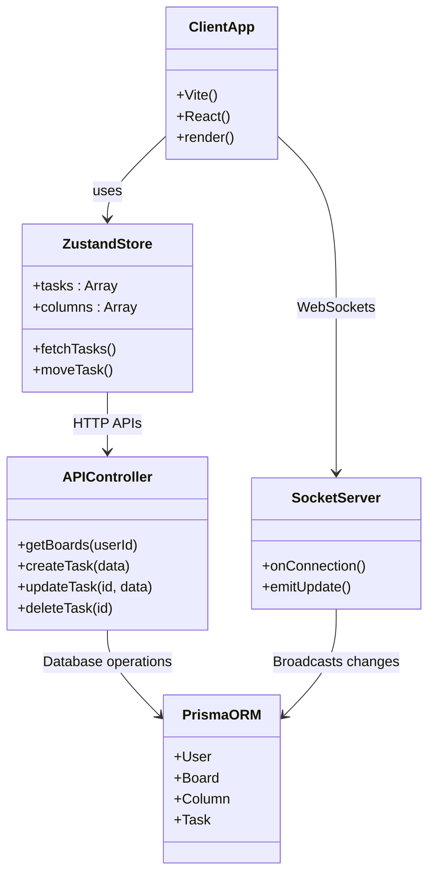

# Class Diagram

```mermaid
classDiagram
    class ClientApp {
        +Vite()
        +React()
        +render()
    }
    
    class ZustandStore {
        +tasks : Array
        +columns : Array
        +fetchTasks()
        +moveTask()
    }

    class APIController {
        +getBoards(userId)
        +createTask(data)
        +updateTask(id, data)
        +deleteTask(id)
    }

    class PrismaORM {
        +User
        +Board
        +Column
        +Task
    }

    class SocketServer {
        +onConnection()
        +emitUpdate()
    }

    ClientApp --> ZustandStore : uses
    ZustandStore --> APIController : HTTP APIs
    ClientApp --> SocketServer : WebSockets
    APIController --> PrismaORM : Database operations
    SocketServer --> PrismaORM : Broadcasts changes
```
