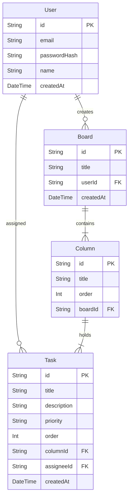

# ER Diagram

```mermaid
erDiagram
    User ||--o{ Board : creates
    User ||--o{ Task : assigned
    Board ||--|{ Column : contains
    Column ||--|{ Task : holds

    User {
        String id PK
        String email
        String passwordHash
        String name
        DateTime createdAt
    }

    Board {
        String id PK
        String title
        String userId FK
        DateTime createdAt
    }

    Column {
        String id PK
        String title
        Int order
        String boardId FK
    }

    Task {
        String id PK
        String title
        String description
        String priority
        Int order
        String columnId FK
        String assigneeId FK
        DateTime createdAt
    }
```
