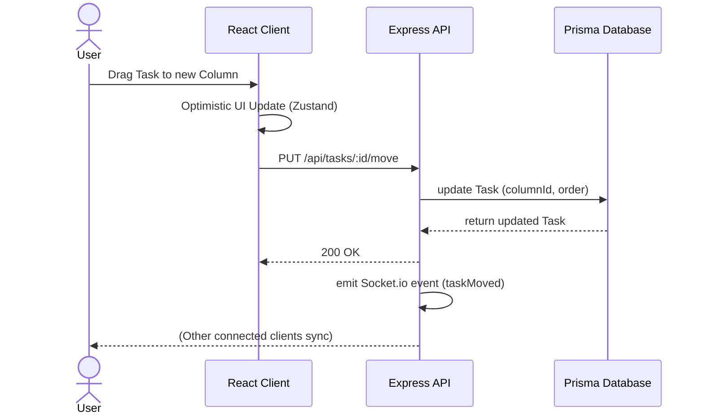

# Sequence Diagram

```mermaid
sequenceDiagram
    actor User
    participant Frontend as React Client
    participant Server as Express API
    participant DB as Prisma Database

    User->>Frontend: Drag Task to new Column
    Frontend->>Frontend: Optimistic UI Update (Zustand)
    Frontend->>Server: PUT /api/tasks/:id/move
    Server->>DB: update Task (columnId, order)
    DB-->>Server: return updated Task
    Server-->>Frontend: 200 OK
    Server->>Server: emit Socket.io event (taskMoved)
    Server-->>User: (Other connected clients sync)
```
