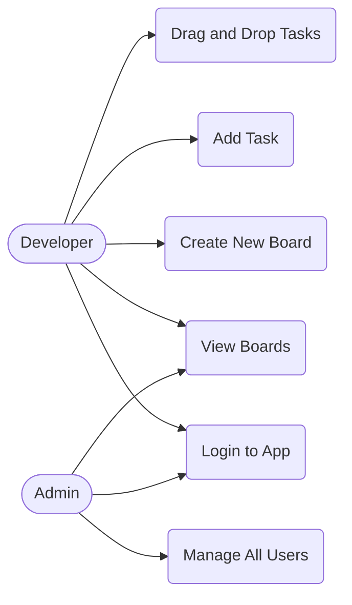

# Use Case Diagram

```mermaid
flowchart LR
    %% Actors
    Actor1([Developer])
    Actor2([Admin])

    %% Use Cases
    UC1(Login to App)
    UC2(View Boards)
    UC3(Create New Board)
    UC4(Add Task)
    UC5(Drag and Drop Tasks)
    UC6(Manage All Users)

    %% Relationships
    Actor1 --> UC1
    Actor1 --> UC2
    Actor1 --> UC3
    Actor1 --> UC4
    Actor1 --> UC5

    Actor2 --> UC1
    Actor2 --> UC6
    Actor2 --> UC2
```
